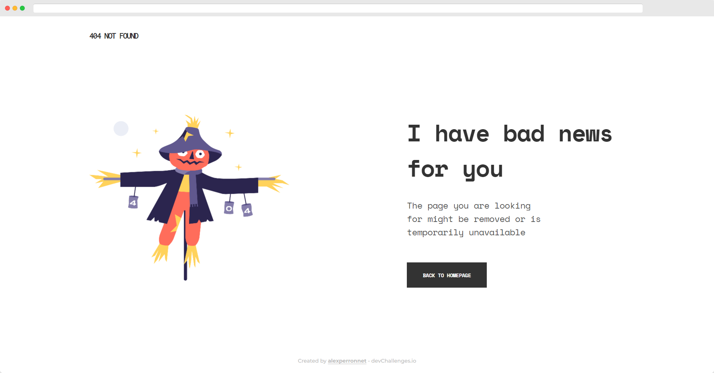

# 404 Not Found

Solution for a challenge from [Devchallenges.io](http://devchallenges.io)

- [Demo](https://ap-devchallenges-404-not-found.netlify.app/)
- [Solution](https://devchallenges.io/solutions/18ZBDOYtI2pSBYYX3pWx)
- [Challenge](https://devchallenges.io/challenges/wBunSb7FPrIepJZAg0sY)

## Table of Contents

- [Overview](#overview)
  - [Built With](#built-with)
- [Features](#features)
- [Contact](#contact)

## Overview

### Built With

- CSS
- HTML5
- [Vite](https://vitejs.dev/)

## Features

This application/site was created as a submission to a [DevChallenges](https://devchallenges.io/challenges) challenge. The [challenge](https://devchallenges.io/challenges/wBunSb7FPrIepJZAg0sY) was to build an application to complete the given user stories.
